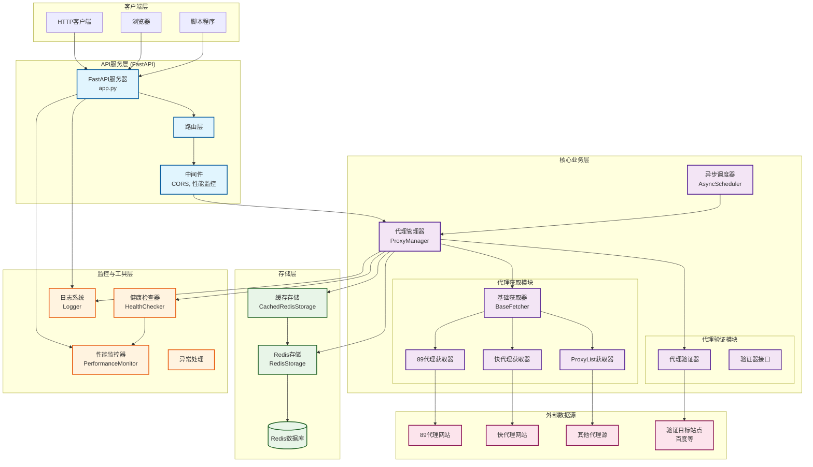

# HighProxyPool - 高效代理池系统


一个高效、稳定的代理池系统，支持多源获取、智能验证和RESTful API服务。

## ✨ 核心特性

- **多源代理获取**: 支持89代理、快代理等多个免费代理网站
- **智能验证**: 异步批量验证代理可用性，自动清理无效代理
- **高性能存储**: 基于Redis的代理存储，支持本地缓存优化
- **自动调度**: 定时获取和验证代理，保持代理池活跃
- **RESTful API**: 提供完整的HTTP API接口
- **容器化部署**: 支持Docker一键部署
- **实时监控**: 系统健康检查和性能监控

## 🚀 快速开始

### 环境要求
- Python 3.9+
- Redis 5.0+

### 本地部署

```bash
# 1. 安装依赖
pip install -r requirements.txt

# 2. 配置Redis (修改 config.yaml)
redis:
  host: "localhost"
  port: 6379

# 3. 启动服务
python main.py    # 启动调度器(后台)
python app.py     # 启动API服务
```

### Docker部署 (推荐)

```bash
# 一键启动
docker-compose up -d

# 查看状态
docker-compose ps
docker-compose logs -f app
```

## 📡 API接口

**基础URL**: `http://localhost:8001`

| 接口 | 方法 | 描述 | 示例 |
|------|------|------|------|
| `/api/get_proxy` | GET | 获取一个可用代理 | `{"proxy":{"http":"1.2.3.4:8080"}}` |
| `/api/proxy_count` | GET | 获取代理池数量 | `{"count":1234}` |
| `/api/proxy_stats` | GET | 获取详细统计 | 包含总数、验证成功率等 |
| `/api/refresh_proxies` | POST | 手动获取代理 | `{"message":"started"}` |
| `/api/clean_proxies` | POST | 手动清理无效代理 | `{"message":"started"}` |
| `/api/health` | GET | 系统健康检查 | 系统状态信息 |

### 使用示例

```python
import requests

# 获取代理
response = requests.get('http://localhost:8001/api/get_proxy')
proxy_data = response.json()
proxy = proxy_data['proxy']['http']

# 使用代理
proxies = {'http': proxy, 'https': proxy}
requests.get('https://httpbin.org/ip', proxies=proxies)
```

## 🏗️ 项目结构

```
HighProxyPool/
├── main.py                 # 调度器入口
├── app.py                  # API服务入口
├── config.yaml            # 配置文件
├── core/                   # 核心模块
│   ├── proxy_manager.py   # 代理管理器
│   ├── fetchers/          # 代理获取器
│   └── validators/        # 代理验证器
├── storage/               # 存储模块
│   ├── redis_storage.py   # Redis存储
│   └── cached_redis_storage.py  # 缓存存储
├── utils/                 # 工具模块
│   ├── scheduler.py       # 异步调度
│   ├── logger.py         # 日志管理
│   └── monitoring.py     # 性能监控
└── tests/                # 测试模块
```

## 🏛️ 系统架构设计



### 🔄 系统工作流程

1. **代理获取流程**：
   - 调度器定时触发代理获取任务
   - 代理管理器调用各个获取器从不同源站抓取代理
   - 获取的代理通过验证器进行可用性验证
   - 有效代理存储到Redis中

2. **代理验证流程**：
   - 定时任务触发代理池清理
   - 从Redis中获取代理进行批量验证
   - 移除失效的代理，保持代理池质量

3. **API服务流程**：
   - 客户端通过HTTP请求获取代理
   - FastAPI路由处理请求
   - 代理管理器从Redis获取可用代理
   - 返回代理信息给客户端

4. **监控流程**：
   - 性能监控器收集系统指标
   - 健康检查器定期检查各组件状态
   - 日志系统记录操作和异常信息

## ⚙️ 配置说明

**config.yaml** 主要配置项：

```yaml
# Redis配置
redis:
  host: "localhost"
  port: 6379
  password: ""
  db: 1

# API服务配置
fastapi:
  host: "0.0.0.0"
  port: 8001

# 调度器配置
scheduler:
  verifier_interval: 900    # 验证间隔(15分钟)
  fetch_interval: 3600      # 获取间隔(60分钟)
  verifier_url: "http://www.baidu.com"
  max_concurrent_validations: 50
```

## 🚀 功能优化建议

### 📈 性能优化

1. **代理质量评分系统**
   - 为每个代理添加成功率、响应时间等质量指标
   - 优先返回高质量代理
   - 支持按质量筛选代理

2. **智能负载均衡**
   - 实现代理使用频率统计
   - 避免过度使用单个代理
   - 支持地域/运营商分组

3. **缓存优化**
   - 增加本地内存缓存层(Redis + Local Cache)
   - 实现代理预热机制
   - 支持缓存失效策略

### 🛡️ 稳定性增强

4. **故障恢复机制**
   - 增加Redis集群支持
   - 实现数据备份和恢复
   - 支持多Redis实例切换

5. **限流和熔断**
   - API请求限流
   - 代理源访问频率控制
   - 异常熔断保护

6. **重试机制优化**
   - 指数退避重试策略
   - 不同类型错误的差异化处理
   - 重试次数和间隔可配置

### 🔍 监控和观测

7. **高级监控功能**
   - Prometheus + Grafana 集成
   - 代理使用情况分析
   - 实时告警系统

8. **详细日志分析**
   - 结构化日志输出
   - 支持日志级别动态调整
   - 集成ELK日志分析栈

9. **性能指标扩展**
   - 代理响应时间分布
   - 成功率趋势分析
   - 资源使用情况监控

### 🔧 功能扩展

10. **多协议支持**
    - HTTP/HTTPS代理
    - SOCKS4/SOCKS5代理
    - 透明代理支持

11. **代理源扩展**
    - 支持更多免费代理网站
    - 付费代理源集成
    - 自定义代理源配置

12. **API功能增强**
    - 支持按地区/类型筛选代理
    - 批量获取代理接口
    - 代理使用统计API
    - WebSocket实时推送

### 🔐 安全性提升

13. **访问控制**
    - API Key认证
    - IP白名单
    - 访问频率限制

14. **数据安全**
    - 敏感信息加密存储
    - 安全的配置文件管理
    - 审计日志


## 🔧 扩展开发

### 添加新的代理源

1. 继承 `BaseFetcher` 类
2. 实现 `fetch_proxies` 方法
3. 在 `ProxyManager` 中注册

```python
from core.fetchers.base_fetcher import BaseFetcher

class NewSiteFetcher(BaseFetcher):
    async def fetch_proxies(self) -> List[Dict]:
        # 实现获取逻辑
        pass
```

### 自定义验证器

```python
from core.interfaces.validator_interface import ValidatorInterface

class CustomValidator(ValidatorInterface):
    async def validate_proxy(self, proxy_info: Dict) -> bool:
        # 实现验证逻辑
        pass
```

## 🧪 测试

```bash
# 运行测试
pytest

# 测试覆盖率
pytest --cov=core --cov=storage --cov=utils
```

## 📊 性能优化

- **并发调优**: 调整 `max_concurrent_validations` 参数
- **缓存优化**: 使用 `CachedRedisStorage` 减少Redis访问
- **间隔调整**: 根据需求调整获取和验证间隔
- **资源监控**: 通过 `/api/health` 监控系统状态

## 🐛 故障排除

| 问题 | 解决方案 |
|------|----------|
| Redis连接失败 | 检查Redis服务状态和配置 |
| 代理获取失败 | 检查网络连接和目标网站状态 |
| 验证速度慢 | 增加并发数或更换验证URL |
| 内存占用高 | 调整缓存大小和清理间隔 |

## 📝 开发计划

- [ ] 支持更多代理源
- [ ] 添加代理质量评分


## 📄 许可证

MIT License - 查看 [LICENSE](LICENSE) 了解详情

## 🤝 贡献

欢迎提交Issue和Pull Request来改进项目。

---

**注意**: 请遵守目标网站的使用条款，合理使用代理服务。